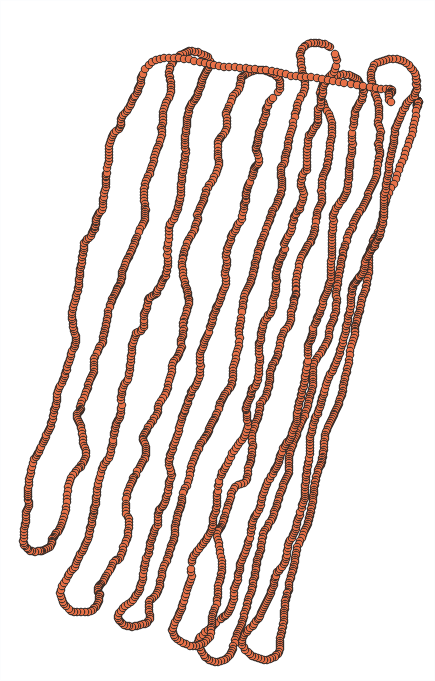

# Transect Aligner

Transect Aligner is a [QGIS 3](https://qgis.org/en/site/) plugin written in python 3.

The purpose of this plugin is to straighten (or align) samples that have been taken along transects but their lat long data is inaccurate due to GPS error. By making assumptions based on known sampling conditions, variables may be set to improve the placement of the data within QGIS.

## Before Transect Aligner

## After Transect Aligner

